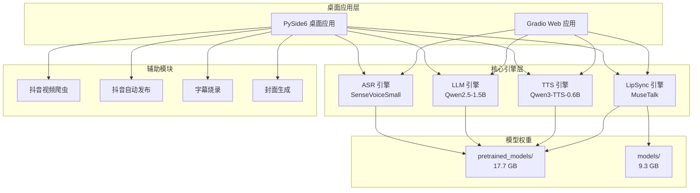
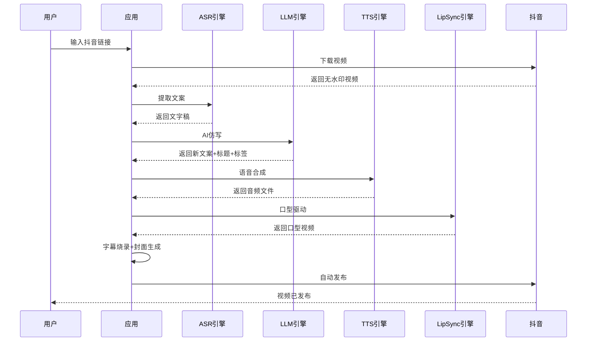
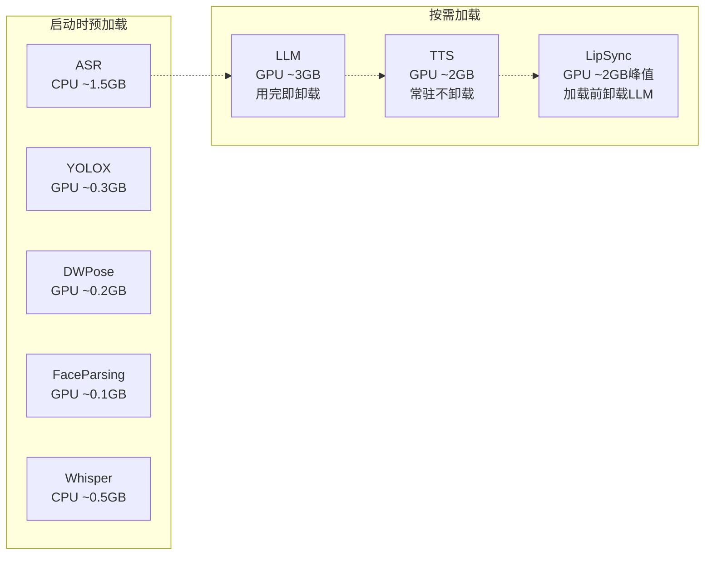
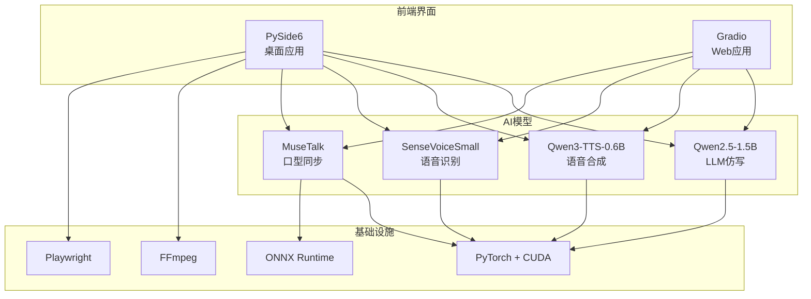

# 口播智能体

> 抖音视频自动合成与发布工具 — 从链接到发布，一键完成

[](https://www.python.org/)
[](https://pytorch.org/)
[](https://developer.nvidia.com/cuda-zone/)
[]()

---

## 项目概述

输入抖音链接，自动完成：**下载 → 提取文案 → AI仿写 → 语音合成 → 口型驱动 → 字幕烧录 → 封面生成 → 发布到抖音**


---

## 核心功能

| 模块 | 功能 | 技术 | 设备 |
|------|------|------|------|
| 📥 视频下载 | 抖音链接 → 无水印视频 | HTTP 爬虫 | — |
| 🎤 文案提取 | 语音 → 文字 | SenseVoiceSmall (FunASR) | CPU |
| ✍️ AI 仿写 | 原始文案 → 口播文案 + 标题 + 标签 | Qwen2.5-1.5B (BF16) | GPU |
| 🔊 语音合成 | 文字 → 语音（预设/克隆/录音） | Qwen3-TTS-0.6B (BF16) | GPU |
| 👄 口型合成 | 人脸素材 + 语音 → 口型视频 | MuseTalk v1.5 | GPU |
| 📝 字幕烧录 | 文案 → 抖音风格字幕 | FFmpeg | — |
| 🎨 封面生成 | 视频首帧 + 标题 → 抖音风格封面 | OpenCV + PIL | — |
| 📤 抖音发布 | 自动上传 + 填写标题/标签/封面 | Playwright | — |

---

## 系统架构



---

## 工作流程



---

## 资源管理策略



**显存峰值约 5 GB**，8GB 显存可正常运行。

---

## 快速启动

### 方式一：双击 EXE（全自动安装）— 推荐客户使用

双击 `口播智能体env.exe`，自动完成：
1. 检测 / 下载 / 安装 Miniconda
2. 创建 conda 虚拟环境 `ip_agent`
3. 安装 PyTorch + CUDA 12.8 + 所有依赖
4. 启动桌面应用

> 首次运行需联网，约 20GB 下载量，耗时 15-30 分钟。

---

## GPU 兼容性

基于 **PyTorch 2.x + CUDA 12.8**（compute capability 7.5+）：

| 架构 | 显卡 | 显存 | 状态 |
|------|------|------|------|
| Turing | GTX 1660 / RTX 2060-2080Ti | 6-11GB | ✅ |
| Ampere | RTX 3060-3090Ti | 8-24GB | ✅ |
| Ada | RTX 4060-4090 | 8-24GB | ✅ |
| Blackwell | RTX 5060-5090 | 8-24GB | ✅ |
| Pascal | GTX 1060/1070/1080 | — | ❌ 不支持 |

> **推荐配置**：RTX 3060 12GB 或以上，8GB 显存为最低可用要求。

---

## 项目结构

```
IP_Agent/
├── 口播智能体.exe          ← 桌面启动器（需已有环境）
├── 口播智能体env.exe       ← 桌面启动器（全自动安装环境）
├── local_models/
│   ├── desktop_app.py      ← PySide6 桌面应用
│   ├── app.py              ← Gradio Web 应用
│   ├── launcher.py         ← EXE 启动器源码
│   ├── launcher_env.py     ← EXE 自动引导启动器源码
│   ├── config.py           ← 模型配置中心
│   ├── asr_engine.py       ← ASR 语音识别引擎
│   ├── llm_engine.py       ← LLM 仿写引擎
│   ├── tts_engine.py       ← TTS 语音合成引擎
│   ├── musetalk_engine.py  ← LipSync 口型合成引擎
│   ├── douyin_crawler.py   ← 抖音视频爬虫
│   ├── publish_simple.py   ← 抖音自动发布
│   └── 打包EXE.bat         ← PyInstaller 打包脚本
├── pretrained_models/      ← 本地模型权重（17.7 GB）
├── MuseTalk_repo/          ← MuseTalk 源码
├── models/                 ← DWPose 等模型（9.3 GB）
├── files/                  ← 离线安装包（可选）
├── media/                  ← 媒体文件（输入/输出）
│   ├── downloads/          ← 下载的抖音视频
│   ├── inputs/             ← 人脸素材、参考音频
│   └── outputs/            ← 合成视频、TTS音频、封面
└── logs/                   ← 运行日志
```

---

## 项目大小

| 组成部分 | 大小 | 说明 |
|---------|------|------|
| **模型权重** | 17.7 GB | pretrained_models/ |
| **Conda 环境** | 9.9 GB | miniconda3/envs/ip_agent2/ |
| **其他模型** | 9.3 GB | models/（DWPose 等） |
| **离线安装包** | 3.7 GB | files/（PyTorch wheel + Miniconda） |
| **媒体文件** | 0.4 GB | media/（输入/输出） |
| **EXE 启动器** | 11 MB | 口播智能体env.exe |
| **总计** | **~41 GB** | 首次部署所需磁盘空间 |

### 模型权重明细

| 模型 | 大小 | 用途 |
|------|------|------|
| MuseTalk | 9.5 GB | 口型同步（VAE + UNet + DWPose + Whisper + FaceParsing） |
| Qwen2.5-1.5B-Instruct | 3.0 GB | AI 文案仿写 |
| Qwen3-TTS-0.6B-Base | 2.4 GB | 语音合成（音色克隆） |
| Qwen3-TTS-0.6B-CustomVoice | 2.4 GB | 语音合成（预设音色） |
| SenseVoiceSmall | 0.9 GB | 语音识别（ASR） |

---

## 依赖

### 核心依赖

| 类别 | 包 | 版本要求 |
|------|-----|---------|
| **深度学习框架** | PyTorch + CUDA 12.8 | ≥ 2.6.0 |
| **LLM 推理** | transformers, bitsandbytes, accelerate | ≥ 5.0.0 / ≥ 0.43.0 / ≥ 0.20.0 |
| **ASR 语音识别** | funasr, modelscope | ≥ 1.0.0 / ≥ 1.14.0 |
| **TTS 语音合成** | qwen-tts, soundfile, librosa | — |
| **口型同步** | onnxruntime-gpu, face_alignment, openai-whisper | — |
| **视频处理** | opencv-python, Pillow, FFmpeg | ≥ 4.8.0 / ≥ 10.0.0 |
| **视频下载** | yt-dlp | ≥ 2024.0.0 |
| **浏览器自动化** | playwright | ≥ 1.40.0 |
| **桌面 UI** | PySide6 | ≥ 6.6.0 |
| **打包工具** | PyInstaller | ≥ 6.0.0 |

---

## 客户交付清单

交付客户时需要以下文件/目录：

```
IP_Agent/
├── 口播智能体env.exe      ← 主程序（双击运行）
├── pretrained_models/     ← 模型权重（17.7 GB，必须）
├── MuseTalk_repo/         ← MuseTalk 源码（必须）
├── models/                ← DWPose 等模型（9.3 GB，必须）
├── files/                 ← 离线安装包（可选，加速首次安装）
│   ├── pip_env/           ← PyTorch wheel（3.6 GB）
│   └── conda_env/         ← Miniconda 安装包（95 MB）
└── local_models/          ← 应用代码（必须）
```

> 最小交付体积：~28 GB（不含 files/ 离线包，需联网下载依赖）  
> 完整交付体积：~32 GB（含 files/ 离线包，可离线安装）

---

## 系统要求

| 项目 | 要求 |
|------|------|
| 操作系统 | Windows 10/11 (64-bit) |
| GPU | NVIDIA，显存 ≥ 8GB（Turing 架构起） |
| 内存 | ≥ 16 GB RAM |
| 磁盘空间 | ≥ 41 GB（首次部署）/ ≥ 28 GB（最小） |
| 网络 | 首次运行需联网（或提供离线包） |

---

## 推理速度参考

| 步骤 | 操作 | 耗时（30秒视频） |
|------|------|-----------------|
| Step 0 | 下载抖音视频 | 5-15s（取决于网络） |
| Step 1 | ASR 语音识别（CPU） | 3-8s |
| Step 2 | LLM 仿写（GPU） | 2-5s |
| Step 3 | TTS 语音合成（GPU） | 3-8s |
| Step 4 | 口型同步（GPU） | 30-90s（取决于帧数） |
| Step 4 | 字幕烧录 + 封面生成 | 5-10s |
| Step 5 | 抖音发布（浏览器自动化） | 10-30s |
| **流水线总耗时** | | **~1-3 分钟** |

> 测试环境：RTX 5060 8GB

---

## 技术栈



---

## 常见问题

<details>
<summary><b>Q: 显存不足怎么办？</b></summary>

- 确保 GPU 显存 ≥ 8GB
- 关闭其他占用显存的程序
- LLM 和 LipSync 不会同时加载，系统会自动管理
</details>

<details>
<summary><b>Q: 首次运行很慢？</b></summary>

- 首次运行需要下载约 20GB 的依赖和模型
- 建议使用离线安装包（files/ 目录）加速安装
- 后续启动速度会显著提升
</details>

<details>
<summary><b>Q: 支持哪些显卡？</b></summary>

- 支持 Turing 架构及以上的 NVIDIA 显卡（GTX 1660 及以上）
- 不支持 Pascal 架构及以下的显卡（GTX 1080 及以下）
- 不支持 AMD / Intel 显卡
</details>

---

## 更新日志

- **v1.5** - 集成 MuseTalk v1.5，优化口型同步质量
- **v1.0** - 初始版本，支持完整的视频合成与发布流程

---

## 许可证

本项目为私有项目，仅供内部使用。

---

<div align="center">

**Made with ❤️ for content creators**

</div>
